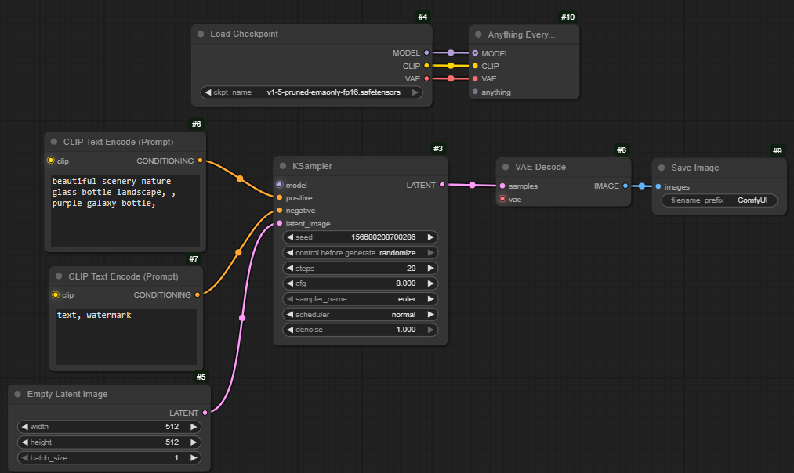

# X-WIDE Use Everywhere

## 🌐 Language / 语言

**简体中文** ｜ [English](README.en.md)

> 本插件是开源项目 [cg-use-everywhere](https://github.com/chrisgoringe/cg-use-everywhere)
> （原作者 [chrisgoringe](https://github.com/chrisgoringe)）的修复版本。
> **只做了一处修复：浏览器端 UE 虚拟连线（以及连线上的「流动」动画）不显示的问题。**
> 节点、参数、行为与原版完全一致，可直接替换。



---

## 这是什么

`Anything Everywhere`（简称 UE）系列节点：给它接上输入，它会把数据**广播**给任何需要这份数据的节点，
于是 MODEL / CLIP / VAE / 提示词这类到处都要用的东西，就不必在每个节点上重复连线。

本项目是原版 `cg-use-everywhere`（UE Nodes）的修复分支，**只修 BUG，不改功能**：

| | 原版 cg-use-everywhere 7.8 | 本版本 X-WIDE Use Everywhere 7.8.1 |
| --- | --- | --- |
| UE 虚拟连线显示 | 部分 ComfyUI 前端版本下**不画线 / 时有时无** | ✅ 自愈看门狗自动补齐，稳定显示 |
| 连线上的流动动画 | 随之不显示 | ✅ 恢复正常 |
| 节点、参数、工作流格式 | — | 与原版**完全一致**（节点 ID 相同） |
| 与原版同时安装 | — | ⚠️ **不可以**（节点 ID 相同会互相覆盖），启动时会打印告警 |

## 修复说明（技术细节）

现象：节点左侧的绿色徽标正常显示，但**看不到任何一条 UE 广播连线**；有时刷新后又出现几条。

原因：插件初始化时依赖若干对象（图分析器 `graphAnalyser`、连线渲染控制器 `linkRenderController`、
画布原型上的 `drawConnections` 钩子、连线列表 `ue_list`）在特定时序下准备就绪。
在部分前端版本下其中某一环没就绪，插件的初始化就静默失败 —— 画布于是**一次都不请求**绘制 UE 连线，
而节点徽标是另一条独立路径（`nodeCreated` 钩子）画的，所以「徽标在、连线全无」。

修复：在 `js/use_everywhere.js` **末尾追加**一段模块级「自愈看门狗」（源码中标记 `[XW-UE fix]`），
页面加载后每 2 秒自检一次，缺什么补什么：

- 缺 `graphAnalyser` / `linkRenderController` → 补建；
- 画布原型的 `drawConnections` 上没有 `render_all_ue_links` 钩子 → 补挂；
- 缺连线列表 `ue_list` → 触发重建，必要时直接 `analyse_graph(visible_graph(), true)` 产出；
- 暂停深度泄漏 → 复位。

一切正常时完全静默、无控制台输出、无性能影响。这一段可以整段删除，删掉即回到原版行为。

## 安装

### 方式一：ComfyUI Manager（推荐，需已上架 Registry）

在 **ComfyUI Manager → Custom Nodes Manager** 里搜索 **`X-WIDE Use Everywhere`**，Install，然后重启 ComfyUI。

### 方式二：手动

```powershell
cd <你的ComfyUI>\custom_nodes
git clone https://github.com/XWIDE/comfyui-xwide-use-everywhere.git
```

重启 ComfyUI，并在浏览器里按 **Ctrl + Shift + R** 硬刷新一次（清掉旧的前端缓存）。

> ⚠️ **请先卸载（或改名禁用）原版 `cg-use-everywhere`**：两者节点 ID 相同，同时安装会互相覆盖。
> 若忘记，启动日志里会出现 `[X-WIDE Use Everywhere] 检测到同时安装了原版插件` 的醒目告警。

## 让连线「流动」起来（推荐设置）

打开 **设置 → Use Everywhere → Graphics**：

| 设置项 | 建议值 | 说明 |
| --- | --- | --- |
| Animate UE links | **Dots** | 原版前端逻辑里 `Pulse` 不会流动，请选 `Dots` |
| Turn animation off when workflow is running | 关 | 开着的话工作流一运行动画就停 |
| Show links | **All**（或 Selected and mouse over） | 控制显示多少条 UE 连线 |
| Statically distinguish UE links | 开 | 静态区分 UE 连线，便于识别 |

改完按 **Ctrl + Shift + R** 硬刷新。

## 关于 / About

**设置 → Use Everywhere → About** 里可以看到作者与修复说明（本版本新增的面板），
也可以直接双击仓库根目录的 [`about.html`](about.html) 打开独立页面。

## 常见问题

- **连线还是不显示？**
  1. 浏览器 **Ctrl + Shift + R** 硬刷新；2. 确认没同时安装原版；3. F12 控制台看有没有
  `[XW-UE fix]` 开头的日志（正常时不会输出任何东西）；4. 设置里 `Animate UE links` 选 `Dots`、`Show links` 选 `All`。
- **会不会破坏我已有的工作流？** 不会。节点 ID、参数、格式与原版 7.8 完全一致。
- **能不能和原版共存、分别用不同的节点？** 不能。节点 ID 相同，只能装一个。

## 许可与致谢

本项目以 **Apache License 2.0** 发布，是 [cg-use-everywhere](https://github.com/chrisgoringe/cg-use-everywhere)
（作者 **chrisgoringe**，Apache-2.0）的修改版本，版权归原作者所有。
修改内容与版权声明见 [NOTICE](NOTICE) 与 [CHANGELOG.md](CHANGELOG.md)；
原版完整使用手册保留为 [UPSTREAM-README.md](UPSTREAM-README.md)。

喜欢这套节点的原始设计，可以去 [请原作者喝咖啡 ☕](https://www.buymeacoffee.com/chrisgoringe)。
